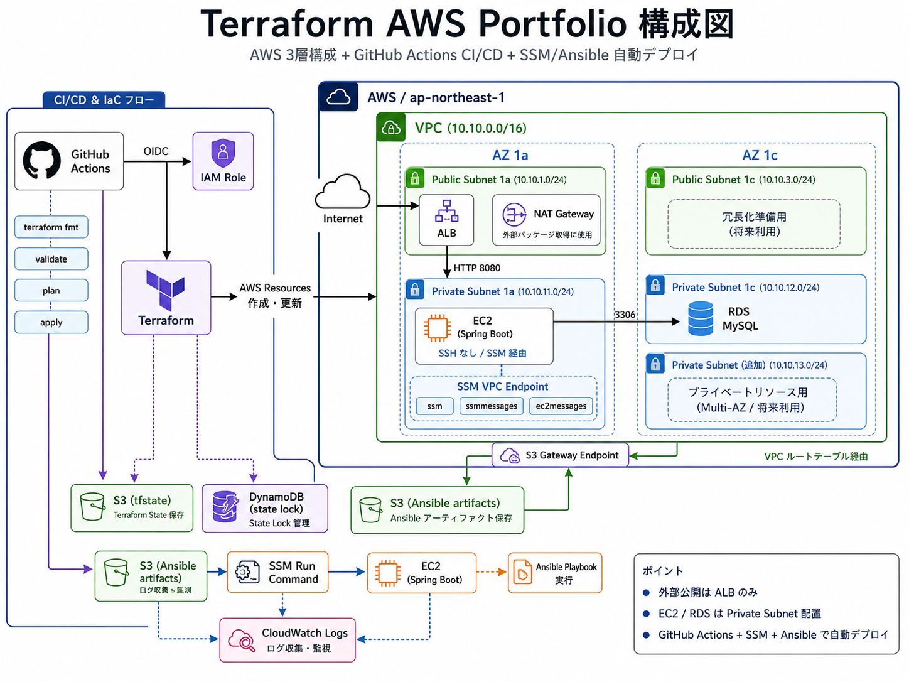

# Terraform AWS Portfolio

## 概要

Terraformを用いてAWS上にWebアプリケーション実行環境を構築したポートフォリオです。

ALB、EC2、RDSを用いた基本的な3層構成を作成し、GitHub ActionsによるCI/CD、SSM Run Command + Ansibleによるアプリケーション自動デプロイまで実装しています。

また、TerraformのstateはS3 + DynamoDBでリモート管理し、複数環境での運用を想定した構成にしています。

## 構成



この構成では、ALBのみを外部公開し、EC2とRDSはPrivate Subnetに配置しています。
GitHub ActionsからOIDCでAWSへ認証し、Terraformによるインフラ構築と、
SSM Run Command + Ansibleによるアプリケーションデプロイを自動化しています。

## 使用技術

* Terraform
* AWS

  * VPC
  * Subnet
  * Internet Gateway
  * NAT Gateway
  * VPC Endpoint
  * ALB
  * EC2
  * RDS
  * S3
  * DynamoDB
  * IAM
  * SSM
  * CloudWatch
* GitHub Actions
* OIDC
* Ansible
* Spring Boot
* MySQL

## 主な実装内容

### TerraformによるAWSインフラ構築

VPC、Public Subnet、Private Subnet、ALB、EC2、RDSなどをTerraformで構築しています。

EC2とRDSはPrivate Subnetに配置し、外部から直接アクセスできない構成にしています。外部公開はALBのみとし、ALB経由でEC2へアクセスする設計にしています。

### tfstateのリモート管理

Terraformのstate管理には、S3とDynamoDBを使用しています。

* S3：tfstateの保存
* DynamoDB：state lockの管理

これにより、ローカル環境に依存しないstate管理を行えるようにしています。

### GitHub ActionsによるCI/CD

GitHub Actionsを使用し、Pull Request作成時に`terraform plan`を実行し、mainブランチへのマージ後に`terraform apply`を実行する構成にしています。

AWS認証には長期アクセスキーを使わず、GitHub Actions OIDCを利用しています。

### OIDCによるAWS認証

GitHub ActionsからAWSへアクセスするために、IAM RoleとOIDCを使用しています。

IAM Roleの信頼ポリシーでは、特定のGitHubリポジトリ、mainブランチ、pull_requestからのアクセスに制限しています。

これにより、不要なリポジトリやブランチからAWSリソースを操作できないようにしています。

### SSM Run Command + Ansibleによる自動デプロイ

EC2はPrivate Subnetに配置しているため、SSHではなくSSM Run Commandを使用して操作しています。

GitHub ActionsからSSM Run Commandを実行し、EC2上でAnsible Playbookを実行することで、Spring Bootアプリケーションのデプロイを自動化しています。

### VPC Endpoint / NAT Gateway構成

EC2をPrivate Subnetに配置したままSystems Managerを利用できるよう、以下のVPC Endpointを作成しています。

* `ssm`
* `ssmmessages`
* `ec2messages`
* `s3`

Interface VPC EndpointではPrivate DNSを有効化し、通常のAWSサービスエンドポイント名を使用したまま、VPC Endpoint経由でSSM関連通信を行える構成にしています。

一方、Ansible実行時には外部リポジトリからパッケージを取得する必要があるため、インターネット向けOutbound通信にはNAT Gatewayを併用しています。

## ディレクトリ構成

```text
.
├── bootstrap
│   ├── backend
│   ├── iam
│   └── s3_artifacts
├── environments
│   └── dev
├── modules
│   ├── network
│   ├── security
│   ├── app
│   ├── iam
│   └── vpc_endpoints
├── ansible
│   ├── roles
│   └── playbooks
└── tests
```

## 前提条件

本環境を構築する前に、bootstrap環境で以下のリソースを作成しておく必要があります。

* tfstate保存用S3バケット
* state lock用DynamoDBテーブル
* GitHub Actions用IAM Role
* EC2用IAM Role
* Ansible配布用S3バケット

## 実行手順

### 1. bootstrap環境の作成

```bash
cd bootstrap
terraform init
terraform plan
terraform apply
```

### 2. dev環境の作成

```bash
cd environments/dev
terraform init
terraform plan
terraform apply
```

### 3. GitHub ActionsによるCI/CD

Pull Request作成時に、TerraformのCIが実行されます。

```text
Pull Request
    ↓
terraform fmt
terraform validate
terraform plan
```

mainブランチへマージすると、TerraformのCDが実行され、AWSリソースが作成・更新されます。

```text
Merge to main
    ↓
terraform apply
```

その後、SSM Run CommandとAnsibleを用いてアプリケーションのデプロイを行います。

## 工夫した点

* EC2をPrivate Subnetに配置し、SSHを使わずSSM経由で操作する構成にした
* GitHub ActionsのAWS認証にOIDCを使用し、長期アクセスキーを不要にした
* tfstateをS3 + DynamoDBで管理し、実運用に近い構成にした
* Terraformコードをmodule化し、network / security / app / iamなどの責務を分けた
* SSM Run CommandとAnsibleを組み合わせ、アプリケーションのデプロイを自動化した
* VPC EndpointとNAT Gatewayの役割を整理し、Private Subnet上のEC2から必要な通信を行えるようにした

## 学んだこと

このポートフォリオを通じて、TerraformによるAWSインフラ構築だけでなく、CI/CD、IAM、ネットワーク、SSM、構成管理ツールを組み合わせた自動化の流れを学びました。

特に、Private Subnet上のEC2へSSHせずにSSMで操作する構成や、GitHub Actions OIDCによるAWS認証は、実務でも利用される考え方を意識して実装しました。

## 今後の改善点

* NAT Gatewayを使わずにデプロイできる構成の検証
* Ansible実行に必要なパッケージをAMIに事前インストールする構成の検討
* CloudWatch Logsやメトリクスを活用した監視の強化
* WAFルールのチューニング
* 本番環境を想定した複数環境構成の追加
